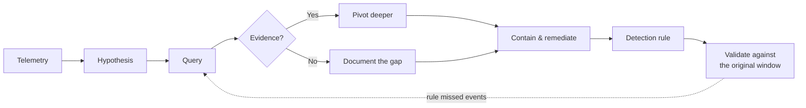

**Cybersecurity Engineer (Intern) for LOG(N) Pacific** in Rio de Janeiro. I reconstruct incidents from telemetry and turn what I find into detections.

BS in Computer Science, currently completing an MS in Cybersecurity and Information Assurance at Western Governors University. **CompTIA CySA+** and **ISC² CC**, working toward PenTest+.

[LinkedIn](https://www.linkedin.com/in/joaomarcelo-miranda/) · [TryHackMe](https://tryhackme.com/p/jo.marcelo) · [YouTube](https://www.youtube.com/@J-MarceloMiranda)

---

## Featured — [Hidden Directive: DFIR Case Study](https://github.com/jo-marcelo/sentinel-mde-dfir-domain-compromise)

Full incident response investigation of a simulated Azure control-plane compromise, reconstructed from Microsoft Sentinel and Defender XDR telemetry.

An attacker used Azure Run Command to reset a local admin password as SYSTEM, then walked to the domain controller over six hours and planted an **AdminSDHolder ACL backdoor** — persistence that Active Directory re-propagates hourly and that survives password resets and host rebuilds.

- 28 documented KQL queries across a 17-hour window and three hosts
- Static analysis of five recovered artefacts, with named-pipe strings matched against live Sysmon telemetry
- Two validated detection rules for techniques that generated no alert during the incident
- Four evidence gaps documented as gaps, with what would resolve each

**[Read the full report (PDF, 20 pages)](https://github.com/jo-marcelo/sentinel-mde-dfir-domain-compromise/blob/main/report/GF-INC-2026-0704-Incident-Report.pdf)**

---

## Other projects

| Project | What it demonstrates | Stack |
|---|---|---|
| **[azure-threat-hunting-kql](https://github.com/jo-marcelo/azure-threat-hunting-kql)** | Hunting internet-facing brute force against an exposed Azure VM, then proving *no* compromise through two independent correlation methods | MDE, KQL, Azure |
| **[mde-threat-hunting-network-slowdown](https://github.com/jo-marcelo/mde-threat-hunting-network-slowdown)** | Tracing a reported network slowdown to an unauthorized Living-off-the-Land PowerShell port scan — detection through containment | MDE, KQL, PowerShell |
| **[stig-hardening-monorepo](https://github.com/jo-marcelo/stig-hardening-monorepo)** | Automated remediation and rollback for 10 DISA STIG controls on Windows 11, built around a scan-verify loop | PowerShell, Local GPO, Registry |
| **[tenable-vuln-management-lab](https://github.com/jo-marcelo/tenable-vuln-management-lab)** | Running a vulnerability management lifecycle end to end across six remediation cycles, each verified by its own delta scan — 24 findings to 4, with one end-of-life package accounting for 17 of them | Tenable Nessus, Azure, PowerShell |

---

## How I work

The dashed line is the part that matters. On the DFIR case, validating a finished rule against the incident it was written from revealed that KQL's `has_any` matches whole tokens — so a rule keying on RemCom's named pipes caught 1 of 7 events, because RemCom appends a random suffix to three of them. Rewriting with `contains` caught all seven and surfaced a second attacker session the original write-up had missed.

---
